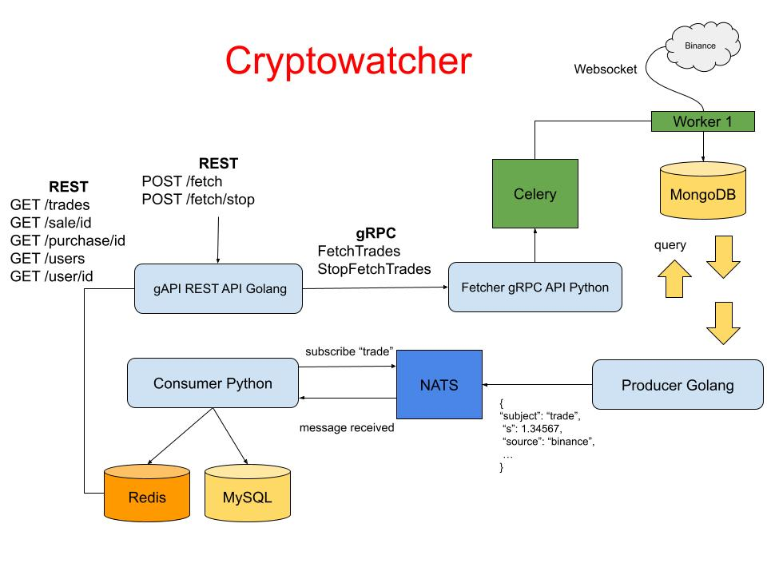

# Cryptowatcher 

- Project used for learning purposes. 
- The goal of this project is to create a simple cryptocurrency watcher by gathering different technologies and using 
them all in a single project Taking this into consideration, there will be some parts of the project that might be 
  redundant. Therefore the project's architecture  could be 
  greatly improved (that is not the project's scope).

## Architecture

## Work in progress

